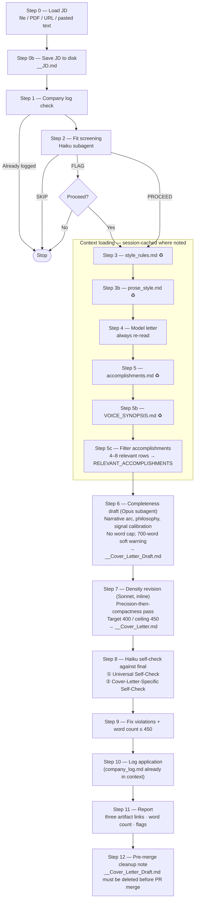

# Cover Letter Skill — Execution Flow

Visual reference for the `/cover-letter` skill execution path. The workflow is two-pass: Opus produces a completeness draft, Sonnet produces a density revision, and the Haiku self-check runs against the revised version.

**Legend:**
- ♻ Session-cached: skip re-read if already in context from a prior letter this session
- Self-check ① then ②: Universal check covers all prose rules; Cover-Letter-Specific covers format, length, structure
- Three artifacts share the stem `MikeBrown_YYYYMMDD__Company__Role__`: `__JD.md` (Step 0b), `__Cover_Letter_Draft.md` (Step 6), `__Cover_Letter.md` (Step 7)

**Token profile (per letter, first in session):**

| Phase | Agent | ~Tokens |
|---|---|---|
| Fit screening | Haiku subagent | 650 |
| Context reads (Steps 3–5b) | Main agent | 1,735 |
| Completeness draft | Opus subagent | 1,620 |
| Density revision | Main agent (Sonnet) | inline |
| Style self-check | Haiku subagent | 700 |

**Batch savings (letters 2-N, session-cached reads):** ~1,170 tokens eliminated per letter (Steps 3, 3b, 5, 5b skip re-reads).

**Lifecycle of the three artifacts:**

| Artifact | Step | In PR? | After merge? |
|---|---|---|---|
| `__JD.md` | 0b | yes | kept |
| `__Cover_Letter_Draft.md` | 6 | yes (cut to final is reviewable) | **deleted** |
| `__Cover_Letter.md` | 7, post-revision | yes | kept (canonical) |

See [ADR 009](../../docs/adr/009-cover-letter-token-efficiency.md) for the original token-efficiency analysis (predates the two-pass workflow; numbers above reflect current flow).
