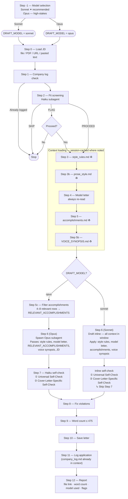

# Cover Letter Skill — Execution Flow

Visual reference for the `/cover-letter` skill execution path, including which steps are
session-cached for batch runs and where the Sonnet and Opus paths diverge.

**Legend:**
- ♻ Session-cached: skip re-read if already in context from a prior letter this session
- Self-check ① then ②: Universal check covers all prose rules; Cover-Letter-Specific covers format, length, structure

**Token profile (per letter, first in session):**

| Phase | Agent | ~Tokens |
|---|---|---|
| Fit screening | Haiku subagent | 650 |
| Context reads (Steps 3–5b) | Main agent | 1,735 |
| Draft — Sonnet inline | Main agent | 0 extra |
| Draft — Opus subagent | Opus subagent | 1,620 |
| Self-check — Sonnet inline | Main agent | 0 extra |
| Self-check — Haiku (Opus path) | Haiku subagent | 700 |

**Batch savings (letters 2-N, session-cached reads):** ~1,170 tokens eliminated per letter
(Steps 3, 3b, 5, 5b skip re-reads).

See [ADR 009](../../docs/adr/009-cover-letter-token-efficiency.md) for the full analysis.
